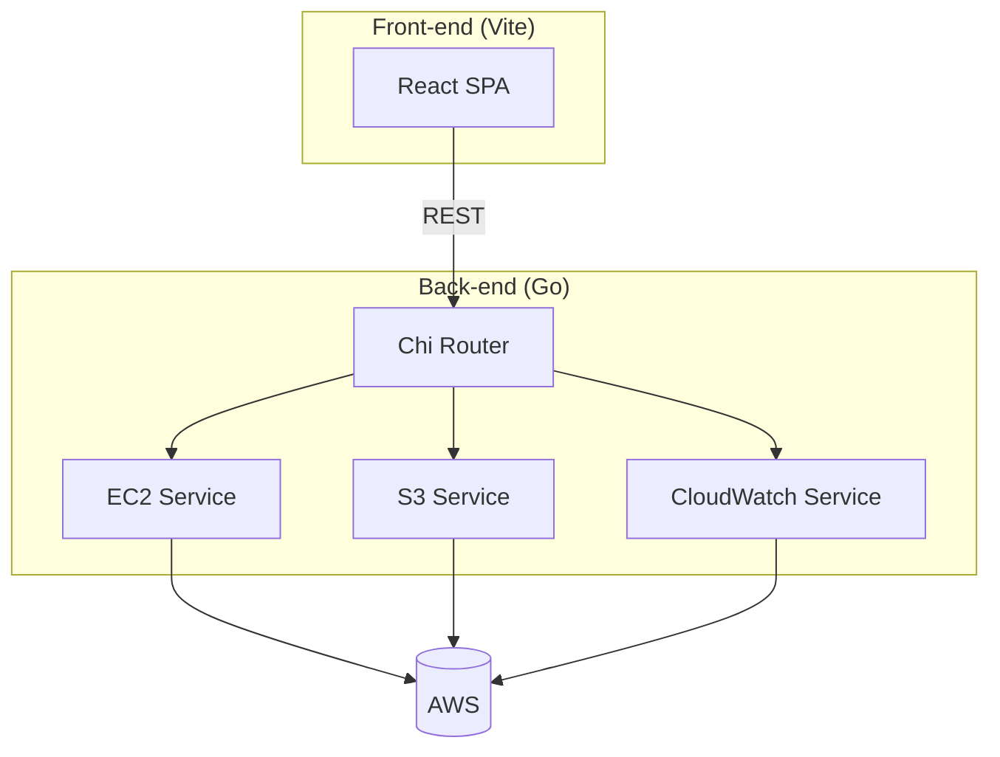

````markdown
# Cloud Resource Dashboard

A lightweight web application for launching, stopping and monitoring AWS EC2
instances, as well as listing S3 buckets and their metadata.  
The backend is written in Go (AWS SDK v2); the frontend is a React + Vite
single-page app.

---

## Features
- **EC2 management** – launch, stop, start, reboot or terminate instances; view
  real-time status and CloudWatch metrics.  
- **S3 overview** – fetch every bucket, its region and creation date in
  parallel using goroutines for snappy response times.  
- **Clean REST API** – Chi router with CORS enabled; endpoints documented
  below.  
- **Modern UI** – React, Tailwind CSS, Chart.js and React-Toastify for
  notifications.  


---

## Folder Layout

```text
.
├── cmd/                  # main server entry-point
├── internal/
│   ├── handlers/         # HTTP handlers (thin)
│   ├── services/         # business logic & AWS calls
│   ├── router/           # Chi router + CORS setup
│   └── utils/            # client factories (EC2, S3, CloudWatch)
├── aws_dashboard/        # React front-end (Vite)
├── go.mod / go.sum       # dependencies
└── .gitignore            # excludes .env files
````

---

## Quick Start

### 1. Backend

```bash
# Go 1.23+
git clone https://github.com/turaneminli/go_backend_aws
cd go_backend_aws
go run ./cmd
```

The server boots on **`localhost:8080`** by default.

> **Credentials**
> Export your AWS profile, or set the standard environment variables
> (`AWS_ACCESS_KEY_ID`, `AWS_SECRET_ACCESS_KEY`, `AWS_REGION`).

### 2. Frontend

```bash
cd aws_dashboard
npm install
npm run dev           # Vite on http://localhost:5173
```

Change `VITE_API_BASE_URL` in `aws_dashboard/.env` if the backend host differs.

---

## API Reference

| Method | Path                   | Description                             |
| ------ | ---------------------- | --------------------------------------- |
| `GET`  | `/regions`             | List all AWS regions                    |
| `POST` | `/instances/launch`    | Launch a new EC2 instance               |
| `POST` | `/instances/stop`      | Stop instance by ID                     |
| `POST` | `/instances/start`     | Start instance by ID                    |
| `POST` | `/instances/reboot`    | Reboot instance by ID                   |
| `POST` | `/instances/terminate` | Terminate instance by ID                |
| `GET`  | `/instances/status`    | Summary of running & stopped instances  |
| `GET`  | `/instances/detail`    | Full detail for a single instance       |
| `GET`  | `/security-groups`     | List security groups in region          |
| `GET`  | `/cloudwatch/metrics`  | CPU, Network In/Out (last hour)         |
| `GET`  | `/s3/buckets`          | List buckets with region & created date |

---

## Architecture



---

## Roadmap

* IAM role switch / STS integration
* WebSocket stream for near-real-time metrics
* Terraform or CDK deployment templates

---


